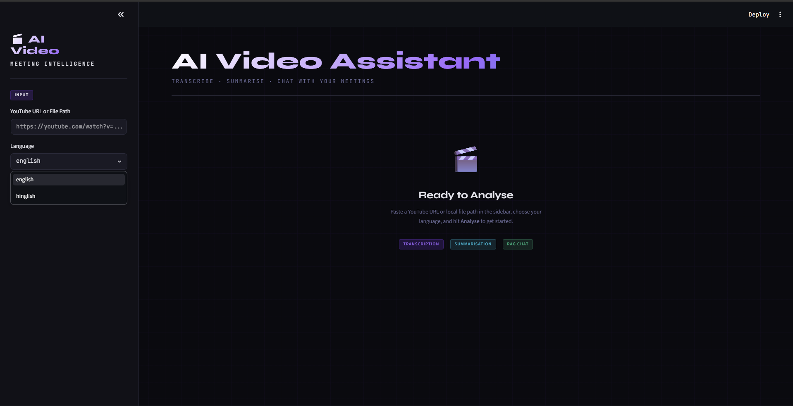
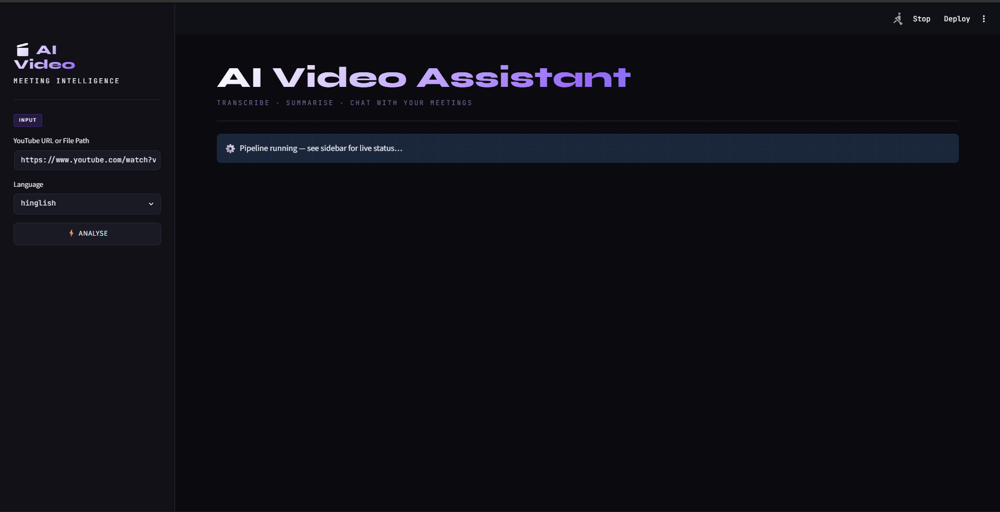
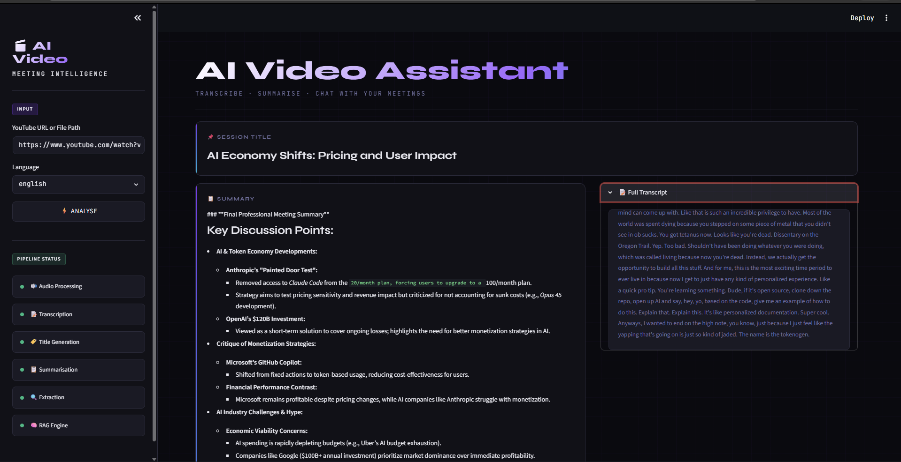
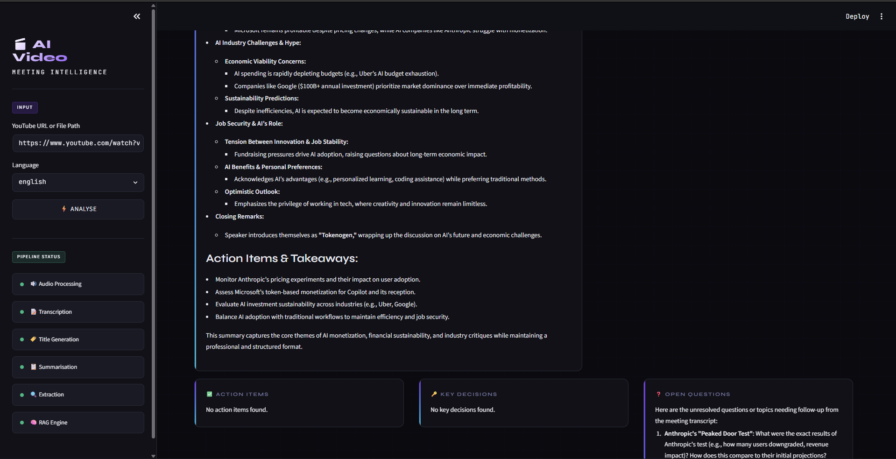
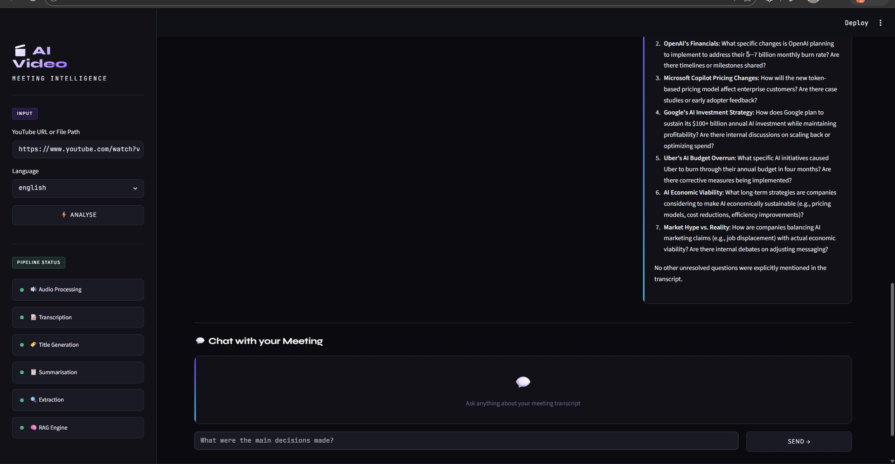

# 🎥 AI Video Assistant RAG

🚀 An AI-powered Video Assistant that enables users to extract insights and ask questions from YouTube videos using a Retrieval-Augmented Generation (RAG) pipeline. The application processes video content, creates vector embeddings, and generates context-aware answers using Large Language Models (LLMs).

---

## 📌 Project Overview

This project combines video processing, transcription, semantic search, and generative AI to create an intelligent video question-answering system.

✨ Key Highlights:
- YouTube video processing
- Automatic audio extraction and transcription
- Vector database creation using embeddings
- Retrieval-Augmented Generation (RAG)
- Context-aware AI responses
- Interactive Streamlit interface

---

## ✅ What This Tool Does 

→ Takes any YouTube URL or audio/video file as input 
→ Transcribes English meetings using local Whisper AI 
→ Transcribes Hindi & Hinglish meetings using Sarvam AI 
→ Summarizes the full meeting in bullet points 
→ Extracts action items with owner and deadline 
→ Extracts key decisions made in the meeting 
→ Extracts open questions and follow-ups 
→ Lets you chat with your meeting using RAG + ChromaDB 
→ Export full report as PDF or TXT

---

## 📸 Project Preview

### 🏠 Home Interface

<p align="center">
  
</p>

<p align="center">
  🔹 User-friendly interface for uploading and processing video content.
</p>

---

### 🎬 Video Processing

<p align="center">
  
</p>

<p align="center">
  🔹 Extracting and preparing video transcripts for semantic retrieval.
</p>

---

### 🧠 Knowledge Extraction

<p align="center">
  
</p>

<p align="center">
  🔹 Converting transcripts into vector embeddings for efficient search.
</p>

---

### 💬 Question Answering

<p align="center">
  
</p>

<p align="center">
  🔹 Ask questions and receive AI-generated answers based on video content.
</p>

---

### ⚡ AI Response Generation

<p align="center">
  
</p>

<p align="center">
  🔹 Context-aware responses generated using the RAG pipeline.
</p>

---

## 🛠️ Tech Stack

→ Python 
→ OpenAI Whisper (Local Speech-to-Text) 
→ Sarvam AI (Hindi & Hinglish Transcription) 
→ LangChain LCEL (Modern RAG Pipeline) 
→ Mistral AI → ChromaDB (Vector Database) 
→ HuggingFace Embeddings 
→ Streamlit

### AI & LLM
- 🧠 LangChain
- 🤖 Mistral AI
- 🔗 OpenAI Whisper

### Vector Database
- 📦 ChromaDB
- 🔍 Sentence Transformers

### Video & Audio Processing
- 🎥 yt-dlp
- 🔊 PyDub
- 🎬 FFmpeg

---

## 📂 Project Structure

```text
AI_Video_Assistant_RAG/
│
├── app.py
├── main.py
├── requirements.txt
├── README.md
├── .env
│
├── core/
│   ├── extractor.py
│   ├── rag_engine.py
│   ├── summarizer.py
│   ├── transcriber.py
│   └── vector_store.py
│
├── utils/
│   └── audio_processor.py
│
├── screenshots/
│   ├── Screenshot1.png
│   ├── Screenshot2.png
│   ├── Screenshot3.png
│   ├── Screenshot4.png
│   └── Screenshot5.png
│
└── .venv/
```

---

## ⚙️ Installation & Setup

### 🔹 Step 1: Clone the Repository

```bash
git clone https://github.com/Sahil-Shrivas/AI_Video_Assistant_RAG-Project.git
cd AI_Video_Assistant_RAG-Project
```

### 🔹 Step 2: Create Virtual Environment

```bash
python -m venv .venv
```

### 🔹 Step 3: Activate Environment

#### Windows

```bash
.venv\Scripts\activate
```

#### Linux / Mac

```bash
source .venv/bin/activate
```

### 🔹 Step 4: Install Dependencies

```bash
pip install -r requirements.txt
```

### 🔹 Step 5: Configure Environment Variables

Create a `.env` file:

```env
OPENAI_API_KEY=your_api_key
MISTRAL_API_KEY=your_api_key
```

### 🔹 Step 6: Run the Application

```bash
streamlit run app.py
```

---

## 🔄 Workflow

```text
YouTube Video URL
         │
         ▼
Audio Extraction
         │
         ▼
Speech-to-Text Transcription
         │
         ▼
Text Chunking
         │
         ▼
Embeddings Generation
         │
         ▼
ChromaDB Vector Store
         │
         ▼
Retriever
         │
         ▼
Mistral LLM
         │
         ▼
AI Generated Answer
```

---

## 🚀 Future Enhancements

- 🌐 Multi-video support
- 💬 Conversational chat memory
- 📄 PDF report generation
- 🔊 Real-time speech interaction
- 📊 Advanced analytics dashboard
- ☁️ Cloud deployment support

---

## 👨‍💻 Author

### Sahil Shrivas

Data Science & Generative AI Enthusiast

- Machine Learning
- Deep Learning
- Generative AI
- RAG Systems
- LLM Applications

---

## ⭐ Support

If you found this project helpful, consider giving it a ⭐ on GitHub!

It helps others discover the project and motivates future improvements.
